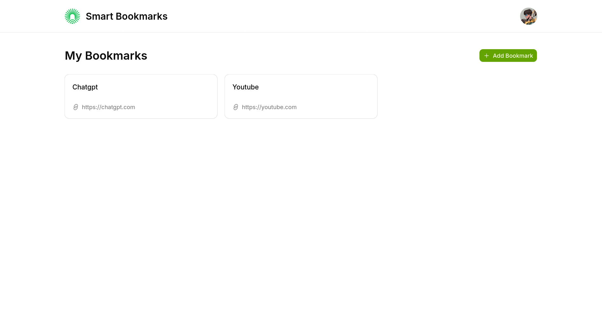
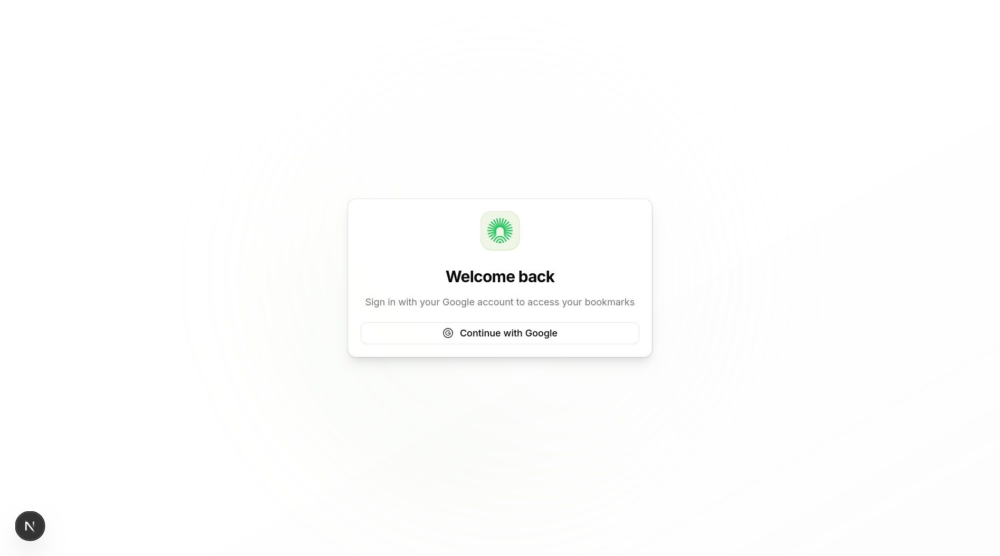

# Smart Bookmark App

A modern bookmark management application built with Next.js 16, featuring real-time updates, Supabase authentication, and a clean UI using Tailwind CSS v4.



## Features

- **User Authentication** - Secure login via Supabase Auth with Google OAuth support
- **Real-time Updates** - Bookmarks sync instantly across all open tabs using Supabase Realtime
- **CRUD Operations** - Create, read, update, and delete bookmarks with a responsive UI
- **Modern Stack** - Built with Next.js 16 App Router, React 19, TypeScript, and Drizzle ORM
- **Beautiful UI** - Custom UI components using @base-ui/react primitives with Tailwind CSS

## Tech Stack

- **Framework:** Next.js 16 (App Router)
- **Language:** TypeScript (strict mode)
- **Styling:** Tailwind CSS v4
- **UI Components:** @base-ui/react primitives (shadcn/ui pattern)
- **Icons:** Hugeicons (@hugeicons/react)
- **Database:** PostgreSQL with Drizzle ORM
- **Auth:** Supabase Auth with SSR
- **Realtime:** Supabase Realtime subscriptions
- **Package Manager:** Bun

## Problems Faced & Solutions

### 1. **TypeScript Error with Supabase Realtime Subscriptions**

**Problem:** The Supabase Realtime subscription API uses a complex type signature that caused TypeScript errors when trying to chain `.on()` and `.subscribe()` methods. The error indicated that the `.on` method signature was incompatible with the expected parameters.

**Solution:** Used a type assertion with `as any` on the `.on` method to bypass the strict typing while maintaining functionality. Added an ESLint disable comment to document the intentional type bypass:

```typescript
const subscription = (supabase
  .channel("bookmarks")
  .on as any)(
    "postgres_changes",
    { event: "*", schema: "public", table: "bookmarks", filter: `user_id=eq.${userId}` },
    (payload: RealtimePayload) => { /* handler */ }
  )
  .subscribe()
```

This allows the Realtime functionality to work while acknowledging the type limitation in the Supabase client library.

### 2. **Client vs Server Component Boundaries**

**Problem:** Next.js 16 App Router requires careful separation between Server Components and Client Components. The bookmark manager needed both server-side data fetching (for initial render) and client-side interactivity (for real-time updates and optimistic UI).

**Solution:** Implemented a hybrid architecture:
- **Server Component** (`dashboard/page.tsx`): Handles authentication check and passes user data to child components
- **Client Component** (`bookmark-manager.tsx`): Manages state, real-time subscriptions, and user interactions
- **API Routes** (`app/api/bookmarks/`): Handle CRUD operations with proper auth validation

This pattern allows the initial page to render on the server (better SEO and faster initial load) while the interactive bookmark grid hydrates on the client with real-time capabilities.

### 3. **Authentication State Management**

**Problem:** Supabase SSR requires different client instances for server and browser environments. Creating a single client caused issues where server-side auth checks would fail or leak session data between requests.

**Solution:** Created separate client factory functions:
- `lib/supabase/server.ts` - Server-side client using cookies for session persistence
- `lib/supabase/client.ts` - Browser-side singleton client for client components
- `lib/supabase/middleware.ts` - Middleware client for route protection and session refresh

This separation ensures proper session isolation and security while maintaining a consistent API across the application.

### 4. **Database Schema Design with Drizzle ORM**

**Problem:** Needed to integrate Supabase Auth with custom application data. The `auth.users` table is managed by Supabase and shouldn't be directly modified, but the app needs to store additional user profile data.

**Solution:** Created a `profiles` table that references the Supabase auth users:

```typescript
export const profiles = pgTable("profiles", {
    id: uuid("id").primaryKey(), // Matches auth.users(id)
    name: text("name"),
    email: text("email"),
    avatarUrl: text("avatar_url"),
    updatedAt: timestamp("updated_at").defaultNow(),
});
```

The `id` field is intentionally not auto-generated—it's designed to match the Supabase auth user ID. In production, you'd set up a database trigger to auto-create profile records when new users sign up.

### 5. **Component Design System Consistency**

**Problem:** Building a consistent UI from scratch requires standardizing component patterns, especially when using @base-ui/react primitives instead of pre-built libraries.

**Solution:** Established strict component conventions (documented in AGENTS.md):
- All UI components use `data-slot` attributes for identification
- Consistent props interface using `React.ComponentProps<"element">`
- Class name merging with `cn()` utility from `tailwind-merge` + `clsx`
- Variant support via `class-variance-authority` (cva)
- 2-space indentation, no semicolons, double quotes

Example pattern:
```typescript
function Button({ variant = "default", className, ...props }: ButtonProps) {
  return (
    <ButtonPrimitive.Root
      data-slot="button"
      className={cn(buttonVariants({ variant }), className)}
      {...props}
    />
  )
}
```

### 6. **Real-time Sync Race Conditions**

**Problem:** When a user creates a bookmark, the optimistic update in the UI could conflict with the real-time subscription inserting the same data, causing duplicate entries.

**Solution:** Added existence checks in the INSERT handler to prevent duplicates:

```typescript
if (payload.eventType === "INSERT") {
  setBookmarks((prev) => {
    const exists = prev.find((b) => b.id === payload.new.id)
    if (exists) return prev
    return [payload.new, ...prev]
  })
}
```

This ensures idempotency—if the bookmark already exists in local state (from optimistic update), it's not added again when the real-time event arrives.

## Project Structure

```
smart-bookmark-app/
├── app/                          # Next.js App Router
│   ├── api/                      # API routes
│   │   ├── auth/callback/        # OAuth callback handler
│   │   └── bookmarks/            # Bookmark CRUD endpoints
│   ├── dashboard/                # Main app dashboard
│   ├── login/                    # Authentication page
│   ├── layout.tsx                # Root layout
│   └── page.tsx                  # Root redirect
├── components/                   # React components
│   ├── ui/                       # Reusable UI primitives
│   ├── bookmark-card.tsx         # Individual bookmark display
│   ├── bookmark-manager.tsx      # Main bookmark grid with real-time
│   ├── add-bookmark-dialog.tsx   # Create bookmark modal
│   └── user-nav.tsx              # User dropdown menu
├── lib/                          # Utilities and configuration
│   ├── db/                       # Database schema and client
│   │   ├── schema.ts             # Drizzle ORM schema
│   │   └── index.ts              # Database connection
│   ├── supabase/                 # Supabase clients
│   │   ├── client.ts             # Browser client
│   │   ├── server.ts             # Server client
│   │   └── middleware.ts         # Auth middleware
│   └── utils.ts                  # Helper utilities (cn, etc.)
├── migrations/                   # Drizzle ORM migrations
├── AGENTS.md                     # Development guidelines
└── README.md                     # This file
```

## Getting Started

### Prerequisites

- [Bun](https://bun.sh) installed
- PostgreSQL database (local or Supabase)
- Supabase project with Auth enabled

### Environment Setup

Create a `.env.local` file:

```bash
NEXT_PUBLIC_SUPABASE_URL=your_supabase_project_url
NEXT_PUBLIC_SUPABASE_ANON_KEY=your_supabase_anon_key
SUPABASE_SERVICE_ROLE_KEY=your_service_role_key
DATABASE_URL=your_postgresql_connection_string
```

### Installation

```bash
# Install dependencies
bun install

# Generate database migrations
bun drizzle-kit generate

# Apply migrations
bun drizzle-kit migrate

# Start development server
bun run dev
```

Open [http://localhost:3000](http://localhost:3000) to view the app.

### Database Schema

The app uses two main tables:

1. **profiles** - Extended user data linked to Supabase Auth
2. **bookmarks** - User bookmarks with foreign key to user

Run migrations to set up the schema:
```bash
bun drizzle-kit migrate
```

## Development Commands

| Command | Description |
|---------|-------------|
| `bun run dev` | Start development server on http://localhost:3000 |
| `bun run build` | Build for production |
| `bun start` | Start production server |
| `bun run lint` | Run ESLint |
| `bun drizzle-kit generate` | Generate migration from schema changes |
| `bun drizzle-kit migrate` | Apply pending migrations |

## Code Style

- **2 spaces** indentation
- **No semicolons**
- **Double quotes** for strings and JSX
- **TypeScript strict mode** enabled
- Use `cn()` utility for class merging
- Add `data-slot` attributes to all UI components
- Import React as `import * as React from "react"`

## License

MIT
